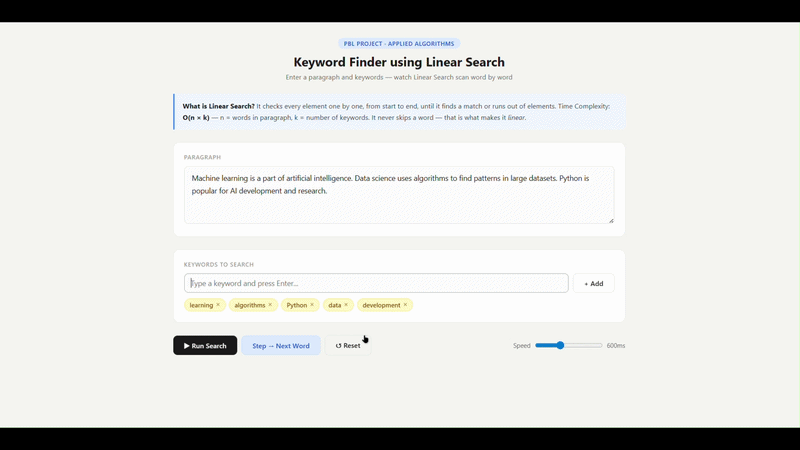

# 🔍 Keyword Finder using Linear Search
### PBL Project — Applied Algorithms | Engineering

---

## 📌 Project Overview

This project demonstrates the **Linear Search Algorithm** applied to real-world text processing — finding keywords inside a paragraph. Every word in the paragraph is scanned one by one and compared against a list of keywords. Matching words are highlighted live on screen.

Built with plain **HTML + CSS + JavaScript** — no frameworks, no libraries, no installation needed. Just open the file in a browser and it  works.

---

## 🎬 Project Demo

<p align="center">
  
</p>

## 🚀 How to Run

1. Download or clone this project folder
2. Open `keyword_finder.html` in any modern browser (Chrome, Firefox, Edge)
3. That's it — no setup, no server, no install required

```
project-folder/
│
├── keyword_finder.html   ← Open this file in your browser
└── README.md             ← This file
```

---

## 🎯 Features

| Feature | Description |
|---|---|
| ▶ Run Search | Auto-scans the entire paragraph word by word with animation |
| Step → Next Word | Manual step mode — one word per click for demonstration |
| ↺ Reset | Clears all results and resets to starting state |
| Speed Slider | Control scan speed from 100ms to 1500ms per word |
| Word Highlighting | Yellow = currently scanning, Green = keyword found |
| Stats Panel | Live count of words scanned, keywords found, comparisons made, time taken |
| Algorithm Trace Log | Dark terminal log recording every single comparison in real time |
| Keyword Tags | Add and remove keywords dynamically before or between searches |

---

## 🧠 Algorithm — Linear Search

### What is Linear Search?
Linear Search checks every element in a list **one by one**, from start to end, without skipping any element. It is also called **Sequential Search**.

### How it works in this project

```
INPUT: paragraph (text), keywords[ ] (list of words to find)

Step 1 → Break paragraph into individual words → tokens[ ]
Step 2 → For each word in tokens[ ]:
              For each keyword in keywords[ ]:
                  comparisons++
                  IF word == keyword → FOUND, highlight green
Step 3 → Show all results, stats, and trace log
```

### Example

**Paragraph:** `"Data science uses Python algorithms"`
**Keyword:** `"Python"`

```
[1] "Data"       ✗  not a keyword
[2] "science"    ✗  not a keyword
[3] "uses"       ✗  not a keyword
[4] "Python"     ✓  FOUND — keyword match!
[5] "algorithms" ✗  not a keyword
```
Total comparisons = 5 words × 1 keyword = **5 comparisons**

### Time Complexity

| Case | Complexity | When it happens |
|---|---|---|
| Best Case | O(k) | Keyword is the very first word |
| Average Case | O(n×k÷2) | Keyword is somewhere in the middle |
| Worst Case | O(n×k) | Keyword is the last word or not present |

> **n** = total words in paragraph &nbsp;|&nbsp; **k** = number of keywords

---

## 🗂️ Project Structure

```
keyword_finder.html
│
├── <style>  ─────────────────────────── CSS Styles
│     ├── Base reset & body
│     ├── Header & badge
│     ├── Panel & input styles
│     ├── Keyword tag styles
│     ├── Button styles
│     ├── Word highlight styles (.word-scanning, .word-found)
│     ├── Progress bar
│     ├── Stats cards
│     └── Trace log (dark terminal)
│
├── <body>  ──────────────────────────── HTML Structure
│     ├── .header          → Title, badge, description
│     ├── .concept         → Linear search info box
│     ├── #para-input      → Paragraph textarea
│     ├── #kw-input        → Keyword input + tags
│     ├── .btn-row         → Run / Step / Reset buttons + speed slider
│     ├── #progress-wrap   → Progress bar + status text
│     ├── #result-panel    → Paragraph with word-by-word highlights
│     ├── #stats-row       → 4 stat cards
│     └── #trace-log       → Algorithm trace log
│
└── <script>  ────────────────────────── JavaScript Logic
      ├── State Variables   → tokens, scanIndex, comparisons, foundCount ...
      ├── renderTags()      → Draw keyword tags on screen
      ├── addKeyword()      → Add keyword from input
      ├── removeKeyword()   → Remove keyword by index
      ├── tokenize()        → Break paragraph into word objects
      ├── renderTokens()    → Draw paragraph with highlight colors
      ├── log()             → Add line to trace log
      ├── doStep()          → ONE step of linear search ← CORE ALGORITHM
      ├── finishSearch()    → Called when all words are done
      ├── prepareSearch()   → Reset everything before new search
      ├── runSearch()       → Start auto mode
      ├── stepSearch()      → Start / advance step mode
      └── resetAll()        → Clear everything
```

---

## 📦 Key Variables Explained

| Variable | Type | Purpose |
|---|---|---|
| `tokens[ ]` | Array | All words (and spaces) from the paragraph as objects |
| `scanIndex` | Number | Current position — which word is being checked right now |
| `comparisons` | Number | Total comparisons made — proves O(n×k) complexity |
| `foundCount` | Number | How many keyword matches have been found |
| `isRunning` | Boolean | True when auto-scan is active |
| `stepMode` | Boolean | True when user is stepping manually |
| `animTimer` | Timer | Holds setTimeout reference so Reset can cancel it |
| `startTime` | Timestamp | Records when search started for elapsed time calculation |
| `totalWords` | Number | Total word count used to calculate progress bar % |

---

## 🔑 Core Function — doStep()

This is the heart of the project. It performs **one step** of linear search.

```javascript
function doStep() {

  // Skip spaces and punctuation
  while (current token is NOT a word) → scanIndex++

  // Check if we reached the end
  if (scanIndex >= tokens.length) → finishSearch()

  // Get current word
  const token = tokens[scanIndex]

  // ── CORE LINEAR SEARCH COMPARISON ──────────────
  comparisons += keywords.length      // count the checks
  const isMatch = keywords.includes(token.clean)   // ← THE CHECK
  // ────────────────────────────────────────────────

  // Highlight word on screen
  renderTokens(scanIndex, isMatch ? 'found' : 'scanning')

  // Write to trace log
  if (isMatch) → log as FOUND (green)
  else         → log as not a keyword (red)
  // Skip spaces and punctuation
  while (current token is NOT a word) → scanIndex++

  // Check if we reached the end
  if (scanIndex >= tokens.length) → finishSearch()

  // Get current word
  const token = tokens[scanIndex]

  // ── CORE LINEAR SEARCH COMPARISON ──────────────
  comparisons += keywords.length      // count the checks
  const isMatch = keywords.includes(token.clean)   // ← THE CHECK
  // ────────────────────────────────────────────────

  // Highlight word on screen
  renderTokens(scanIndex, isMatch ? 'found' : 'scanning')

  // Write to trace log
  if (isMatch) → log as FOUND (green)
  else         → log as not a keyword (red)

  // Move to next word
  scanIndex++

  // Auto mode → schedule next step
  if (isRunning && !stepMode) → setTimeout(doStep, speed)
}
```

---

## 🆚 Linear Search vs Binary Search

| | Linear Search | Binary Search |
|---|---|---|
| **Data requirement** | Works on any data — sorted or unsorted | Requires sorted data only |
| **Time complexity** | O(n) | O(log n) |
| **Finds all occurrences** | Yes | No — stops at first match |
| **Implementation** | Simple — one loop | Complex — divide and conquer |
| **Used in this project** | ✅ Yes | ❌ Cannot use — paragraph is unsorted |

---

## ❓ Viva Quick Reference

**Q: Why linear search for a paragraph?**
A: A paragraph is unsorted text. Binary search requires sorted data. Linear search works on any data — making it the only correct choice here.

**Q: What is the time complexity?**
A: O(n × k) — n words × k keywords. Worst case is when the keyword is the last word or absent.

**Q: How does the trace log prove linear search?**
A: Every word appears in order [1], [2], [3]... No word is skipped. The comparison count equals exactly n × k.

**Q: What does scanIndex do?**
A: It is the pointer that moves from 0 to n-1, one step at a time. It is the variable that makes the search linear.

**Q: What is tokenization?**
A: Breaking the paragraph into individual word objects so the algorithm can compare them one by one.

---

## 🛠️ Technologies Used

- **HTML5** — Structure and layout
- **CSS3** — Styling, animations, color highlights
- **Vanilla JavaScript** — All algorithm logic, DOM manipulation, timers

No external libraries. No frameworks. No build tools.

---

## 👨‍💻 Project Info

- **Type:** Problem Based Learning (PBL) — Engineering
- **Topic:** Applied Algorithms — Linear Search
- **Language:** HTML + CSS + JavaScript
- **Algorithm:** Linear Search — O(n × k)

---

*Built as a PBL project to demonstrate Linear Search Algorithm with real-time visualization.*

  // Move to next word
  scanIndex++

  // Auto mode → schedule next step
  if (isRunning && !stepMode) → setTimeout(doStep, speed)
}
```

---

## 🆚 Linear Search vs Binary Search

| | Linear Search | Binary Search |
|---|---|---|
| **Data requirement** | Works on any data — sorted or unsorted | Requires sorted data only |
| **Time complexity** | O(n) | O(log n) |
| **Finds all occurrences** | Yes | No — stops at first match |
| **Implementation** | Simple — one loop | Complex — divide and conquer |
| **Used in this project** | ✅ Yes | ❌ Cannot use — paragraph is unsorted |

---

## ❓ Viva Quick Reference

**Q: Why linear search for a paragraph?**
A: A paragraph is unsorted text. Binary search requires sorted data. Linear search works on any data — making it the only correct choice here.

**Q: What is the time complexity?**
A: O(n × k) — n words × k keywords. Worst case is when the keyword is the last word or absent.

**Q: How does the trace log prove linear search?**
A: Every word appears in order [1], [2], [3]... No word is skipped. The comparison count equals exactly n × k.

**Q: What does scanIndex do?**
A: It is the pointer that moves from 0 to n-1, one step at a time. It is the variable that makes the search linear.

**Q: What is tokenization?**
A: Breaking the paragraph into individual word objects so the algorithm can compare them one by one.

---

## 🛠️ Technologies Used

- **HTML5** — Structure and layout
- **CSS3** — Styling, animations, color highlights
- **Vanilla JavaScript** — All algorithm logic, DOM manipulation, timers

No external libraries. No frameworks. No build tools.

---

## 👨‍💻 Project Info

- **Type:** Problem Based Learning (PBL) — Engineering
- **Topic:** Applied Algorithms — Linear Search
- **Language:** HTML + CSS + JavaScript
- **Algorithm:** Linear Search — O(n × k)

---

*Built as a PBL project to demonstrate Linear Search Algorithm with real-time visualization.*
